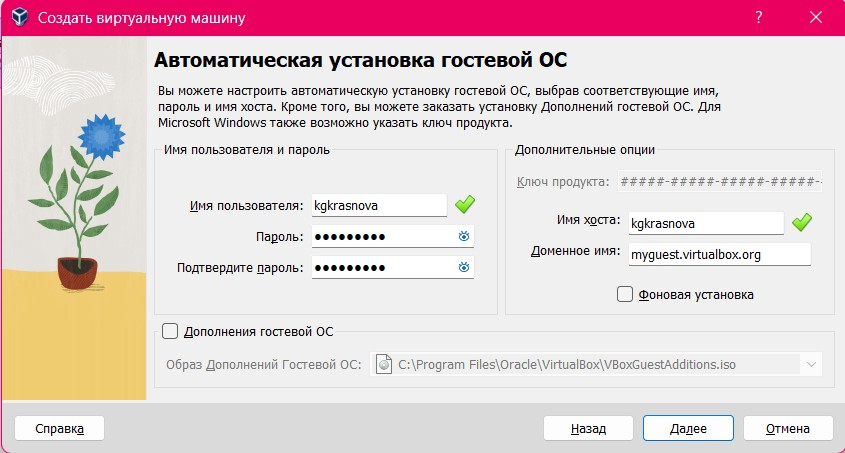
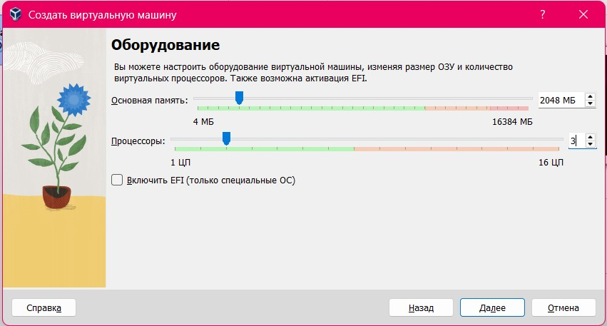
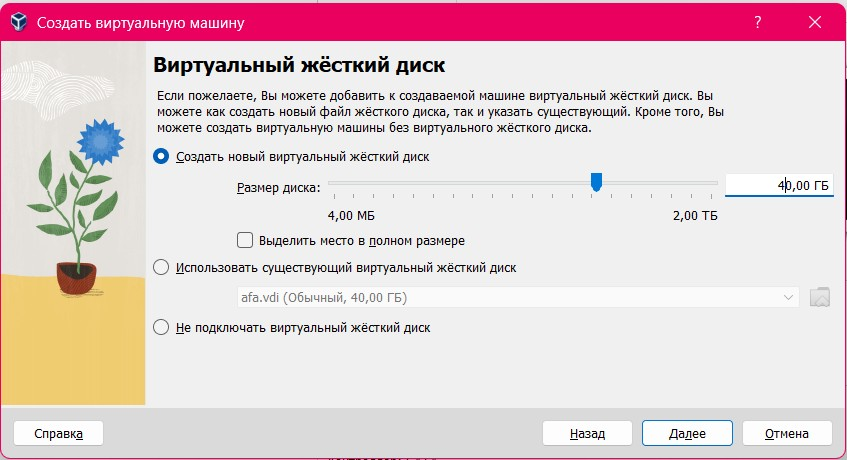
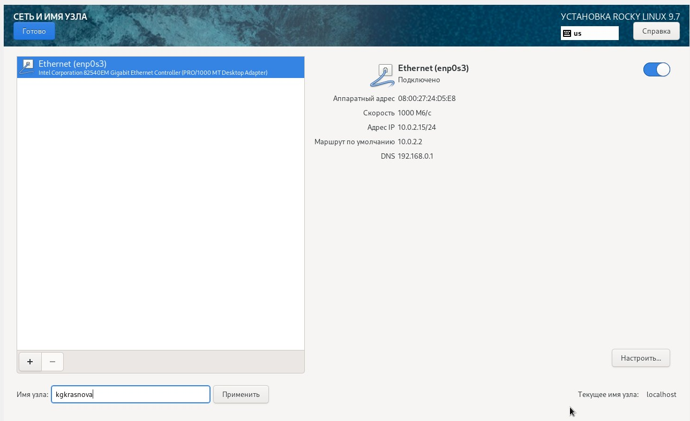
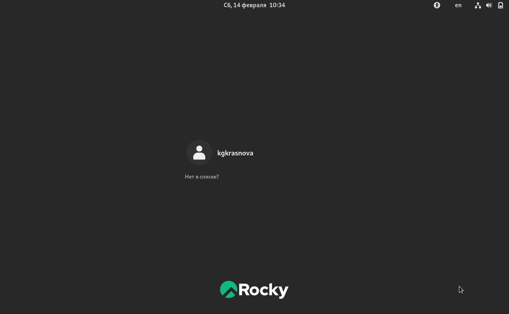
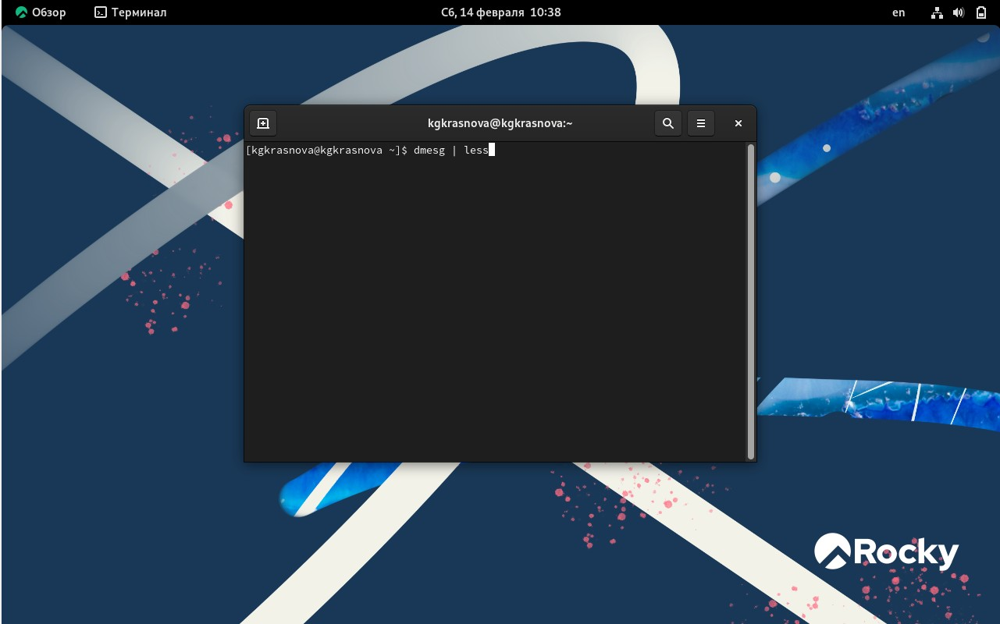
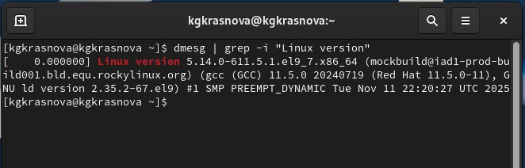
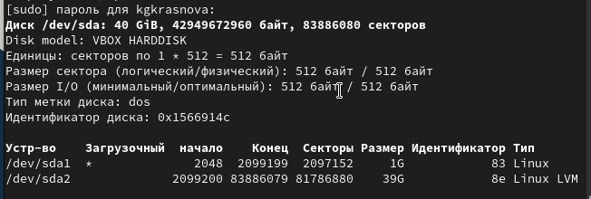
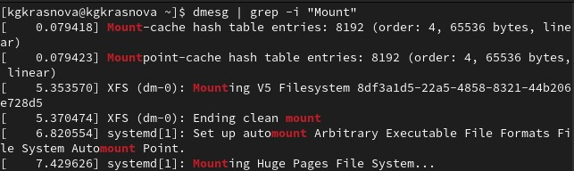

---
## Front matter
lang: ru-RU
title: Лабораторная работа №1
subtitle: Основы информационной безопасности
author:
  - Краснова К. Г., НКАбд-03-24
institute:
  - Российский университет дружбы народов, Москва, Россия
date: 17 февраля 2026

## i18n babel
babel-lang: russian
babel-otherlangs: english

## Formatting pdf
toc: false
toc-title: Содержание
slide_level: 2
aspectratio: 169
section-titles: true
theme: metropolis
header-includes:
 - \metroset{progressbar=frametitle,sectionpage=progressbar,numbering=fraction}
---

# Вводная часть

## Цели и задачи

Целью данной работы является приобретение практических навыков установки операционной системы на виртуальную машину, настройки минимально необходимых для дальнейшей работы сервисов.

## Задание

1. Установка и настройка операционной системы.
2. Найти следующую информацию:
    1. Версия ядра Linux.
    2. Частота процессора.
    3. Модель процессора.
    4. Объем доступной памяти.
    5. Тип обнаруженного гипервизора.
    6. Тип файловой системы корневого раздела.

## Выполнение лабораторной работы

Я выполняю лабораторную работу на домашнем оборудовании, поэтому создаю новую виртуальную машину в VirtualBox, выбираю имя, местоположение  и образ ISO, устанавливать будем операционную систему Rocky DVD (рис. 1).

{#fig:001 width=70%}

## Выполнение лабораторной работы

Выбираю имя пользователя (рис. 2).

{#fig:002 width=70%}

## Выполнение лабораторной работы

`Размер основной памяти 2048мб, 3 процессора (рис. 3).

{#fig:003 width=70%}

## Выполнение лабораторной работы

Выделяю 40 Гб памяти на виртуальном жестком диске (рис. 4).

{#fig:004 width=70%}

## Выполнение лабораторной работы

роверяю выставленные настройки (рис. 5).

{#fig:005 width=70%}

## Выполнение лабораторной работы

Начинается загрузка ОС. Далее выбираю язык (рис. 6).

{#fig:006 width=70%}

## Выполнение лабораторной работы

Меняю часовой пояс, язык раскладки (рис. 7).

{#fig:007 width=70%}

## Выполнение лабораторной работы

Установка пароля для администратора(рис. 8).

{#fig:008 width=70%}

## Выполнение лабораторной работы

Задаю имя пользователя и пароль (рис. 9).

{#fig:009 width=70%}

## Выполнение лабораторной работы

Выбираю окружение сервер с GUB и средства разработки в дополнительном программном обеспечении. далее отключаю kdump (рис. 10).

{#fig:010 width=70%}

## Выполнение лабораторной работы

Указываю имя узла в соответствии с соглашением об именовании  (рис. 11).

{#fig:011 width=70%}

## Выполнение лабораторной работы

Начинается установка (рис. 12).

{#fig:012 width=70%}

## Выполнение лабораторной работы

 После установки при запуске операционной системы появляется окно выбора пользователя (рис. 13).

{#fig:013 width=70%}

## Выполнение лабораторной работы

Открываю терминал, в нем прописываю dmesg | less (рис. 14).

{#fig:014 width=70%}

## Выполнение лабораторной работы

Версия ядра (рис. 15).

{#fig:015 width=70%}

## Выполнение лабораторной работы

Частота процессора (рис. 16).

{#fig:016 width=70%}

## Выполнение лабораторной работы

Модель процессора Intel Corе (рис. 17).

{#fig:017 width=70%}

## Выполнение лабораторной работы

Доступная память (рис. 18).

{#fig:018 width=70%}

## Выполнение лабораторной работы

Обнаруженный гипервизор типа KVM (рис. 19).

{#fig:019 width=70%}

## Выполнение лабораторной работы

sudo fdish -l показывает тип файловой системы, типа Linux, Linux LVM (рис. 20).

{#fig:020 width=70%}

## Выполнение лабораторной работы

Далее показана последовательно монтирования файловых систем (рис. 21).

{#fig:021 width=70%}

## Выводы

Я приобрела практические навыки
установки операционной системы на виртуальную машину, настройки минимально необходимых для дальнейшей работы сервисов.

